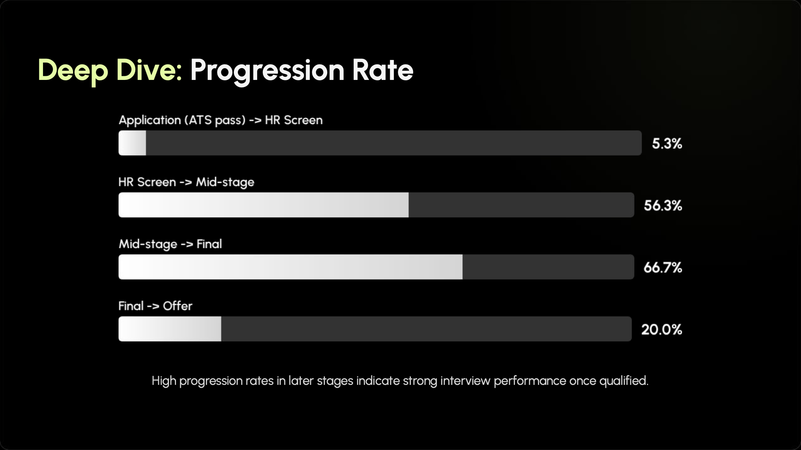
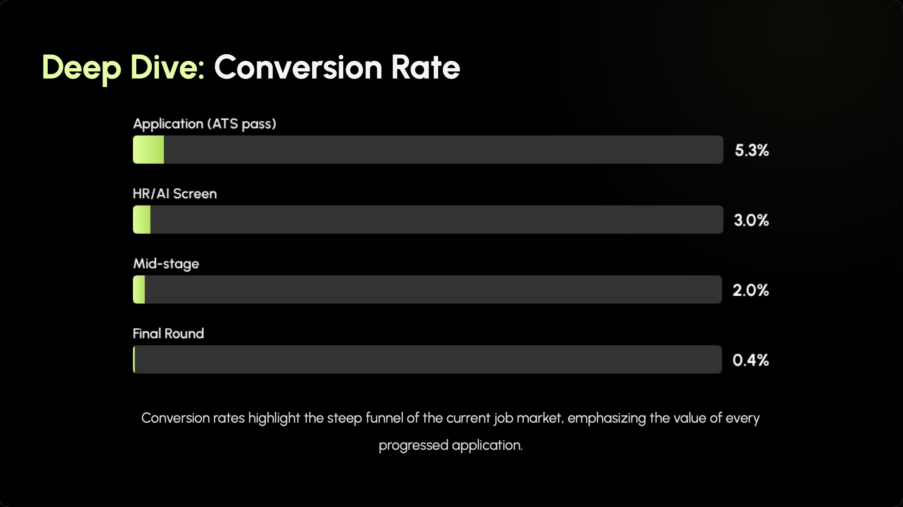

# Job Hunting in AI Era

_I have included a PDF presentation in this repository that summarizes my strategy. This deck was created with the help of **Gemini 3**, showcasing how I leverage AI to structure complex data into professional insights._

**Quick Navigation:**
> - [**Job Search Timeline**](#section-1)
> - [**Preparation Framework**](#section-2)
> - [**Key Resources & Tools**](#section-3)
> - [**Final Advice & Key Takeaways**](#section-4)
 

## 🗓️ Job Search Timeline

### Phase 1: Preparation (Jan 2025 - Apr 2025)
* Polishing **resume**, [**LinkedIn profile**](http://www.linkedin.com/in/lillian-lin-/), and [**GitHub portfolio**](https://github.com/Lillian1070).
* Identifying target roles and companies; submitted **early/exploratory** applications.
* Initial technical/behavioral interview practice.

### Phase 2: Active Applications (May 2025 - Nov 2025)
* Submitted **targeted** applications.
* Networking and reaching out for referrals.
* Actively practiced technical/behavioral interviews.

### Phase 3: Interviewing (May 2025 - Nov 2025)
* Completed multiple rounds leading to **5 final interviews** (excluding 1 still on hold due to reorg).

* **My interview progression and conversion data:**
  * **Progression data:** The rate of moving from the **current stage** to the **next stage** (stage-to-stage movement).
  * **Conversion data:** The rate of success from the **initial application stage** down to the **next stage** (cumulative end-to-end success).

    | Stage | Progression Rate (%) | Conversion Rate (%) | 
    | ----- | -------------------- | ------------------- | 
    | **Application (ATS pass)**     | **5.3%**  | **5.3%** |
    | **HR/AI screen call** | **56.3%** | **3.0%** |
    | **Mid-stage**         | **66.7%** | **2.0%** |
    | **Final round**       | **20.0%** | **0.4%** |

    **Note: Final round rates exclude **1** role currently on hold.*

 * **Visualizing the Funnel:**

   **1. Interview Progression (Stage-to-Stage)**
       
   >**Insight:** High progression rates in later stages (e.g., **66.7%** Mid-stage to Final) indicate strong interview performance once qualified for the role.

    
       
   **2. Market Conversion (Cumulative Success)**
       
   >**Insight:** Cumulative conversion rates (ending at **0.4%**) highlight the steep funnel of the 2025 job market, emphasizing the value of every progressed application.

    

### Phase 4: Offer (Nov 2025 - Dec 2025)
* Negotiated and accepted **1** full-time offer (**FAANG-level**).
* Pivoted to a **Business Analytics/Data Science** role (leveraging market research background).

## ⚙️ Preparation Framework

### 1. Resume & Profile Tuning
* **Resume & LinkedIn profile (AI-Powered):** Used AI to optimize keywords to be **ATS** (Applicant Tracking System)-friendly and match the target role's JD.
* **GitHub portfolio:** Updated SQL & Python projects that demonstrate my visualization and analytical skills (targeting skillset for target roles).
* **Featured projects:**

  * **[Identifying Data Patterns using SQL](https://github.com/Lillian1070/showcase_sql_7):** Demonstrates advanced application of `Window Functions` and `CTEs` to identify business logic anomalies. 

  * **[Product Analytics & Business EDA using Python](https://github.com/Lillian1070/showcase_python_EDA_1):** Demonstrates data manipulation using `Pandas` and analytical storytelling through visualization. 

### 2. Application Strategy
* **Job Boards:** [LinkedIn Jobs page](https://www.linkedin.com/jobs/), company career pages, etc.
* **Networking:** Online communities, in-person events, referrals, cold outreach, etc.
* **Tracking:** Used a Google Sheet to track applications, interview stages & preparation details, and networking contacts.

### 3. Behavioral Interview Prep: 
* **Story Bank:** Built a **customized** story bank in Google Sheet for [common questions](https://www.reddit.com/r/interviews/comments/1ksjsih/10_interview_questions_you_should_practice_no/). 
* **Company Research (AI-Powered):** Used AI to summarize companies' recent news, quarterly earnings reports, and shareholder letters to prepare for *"Why this company?"* questions.
* **Answering Approach:** Used the **STAR method** (Situation, Task, Action, Result) or **XYZ formula** (Result, Metric, Action) to structure all answers.
* **Practice (AI-Powered):** Recorded answers and used AI to analyze the structure and provide feedback.

  
### 4. Technical/Case Interview Prep: 
* **Topics:** SQL (`Window Functions`, `CTEs`, `Joins`, `Subqueries`), Python (`Pandas`, `Matplotlib`, `Seaborn`), Case Studies (Market Sizing, Product Sense, Root Cause Analysis), A/B Testing.
* **Interview Approach:** Adopted a structured problem-solving framework:

  | Step | What I Do |
  | ---- | --------- |
  | **(1)**|  Clarifying Questions/Definitions | 
  | **(2)**|  Reviewing Data | 
  | **(3)**|  Stating Initial Hypothesis/Thoughts | 
  | **(4**)|  Explaining Logic while Coding | 
  | **(5)**|  Analyzing Results | 
  | **(6)**|  Sharing Insights |
  
* **Practice (AI-Powered):** Focused on daily, consistent practice of SQL problems and reviewing case study frameworks; and leveraged AI to quickly explain complex technical concepts, suggest alternative problem approaches, and analyze recorded answers to provide structural feedback.

### 5. Customized Job Hunting System 
* **Habit Trackers:** Used a daily routine checklist to ensure I was balancing applications, learning, networking, and health.
* **Journaling:** Used a 3-minute future diary and a daily gratitude/highlight diary to stay positive and process rejections.
* **Other:** Used time-blocking to structure my days, and prioritized exercise to manage stress.

## 📚 Key Resources & Tools

### Learning & Practice
* **Behavioral interview prep**: [Amazon's 16 Leadership Principles](https://amazon.jobs/content/en/our-workplace/leadership-principles) (A great framework for any company's behavioral questions).
* **Technical interview prep**: 
    * **SQL practice**: [LeetCode](https://leetcode.com/studyplan/top-sql-50/), [StrataScratch](https://platform.stratascratch.com/coding?code_type=1&page_size=100), [DataLemur](https://datalemur.com/questions?category=SQL), [HackerRank](https://www.hackerrank.com/domains/sql), etc.
    * **SQL knowledge**: [W3Schools](https://www.w3schools.com/sql/), [GeeksForGeeks](https://www.geeksforgeeks.org/sql/sql-tutorial/), [DataCamp](https://www.datacamp.com/cheat-sheet/sql-basics-cheat-sheet), etc.
    * **Great mock interview examples**: [SQL Mock Interview #1](https://youtu.be/lnhuCj0EfPI?si=P5ms6Py3P-S0585G) (Data Science), [SQL Mock Interview #2](https://youtu.be/EYxoPVSBKcU?si=ur10w5b-K37ys1ng) (Data Analyst)

### AI Tools
* **[Gemini](https://gemini.google.com/):** My top choice for analyzing my mock interview recordings (audio/video) and for fact-checking.
* **[NotebookLM](https://notebooklm.google/):** Best for learning and summarizing large documents (like earnings reports).
* **[Grok](https://grok.com/):** Best for real-time news analysis and getting a "market sentiment" feel.
* **[ChatGPT](https://chatgpt.com/):** My go-to for SQL debugging, building logic trees, and quick brainstorming.

## ✨ Final Advice & Key Takeaways

* **Consistency over intensity.** Prioritize sustainable momentum and your health over short, intense bursts that may lead to burnout.
* **Trust the process.** Stick to your system. Your networking habits and consistent daily effort are cumulative and will pay off. 
* **Rejection is data, not a failure.** Use every "no" as feedback to refine your strategy, build resilience, and move forward. 
* **Control the narrative.** Believe in your own journey. Turn all your experiences into a powerful story that clearly demonstrates your unique value, impact, and resilience. 

_💬 Feel free to connect or reach out. I'm always happy to discuss my journey, offer advice, or chat about all things data & AI!_
